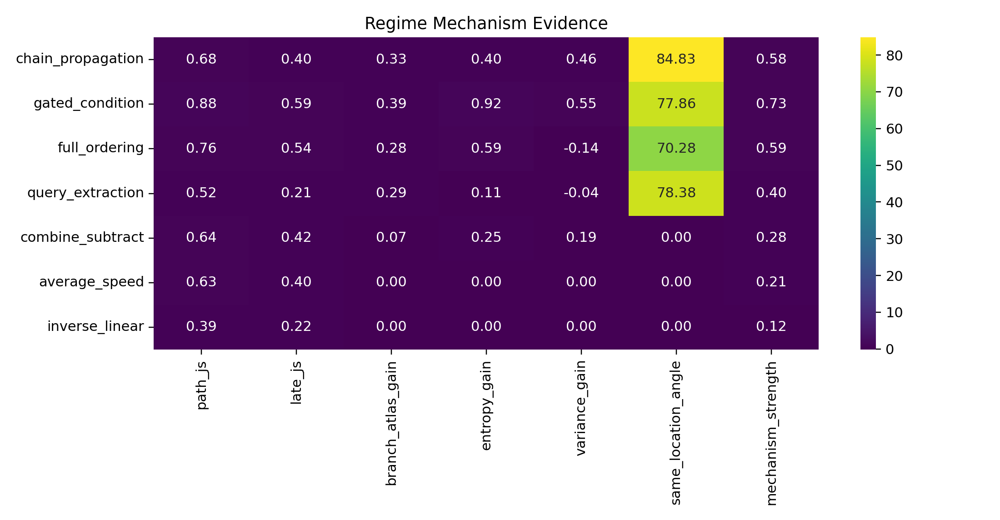
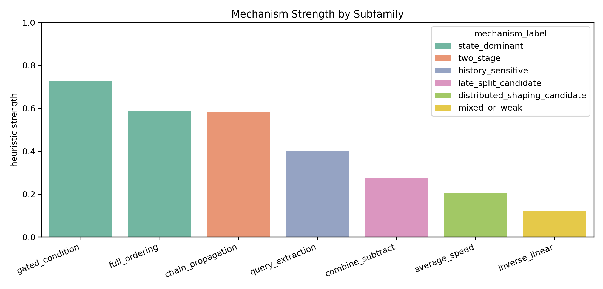
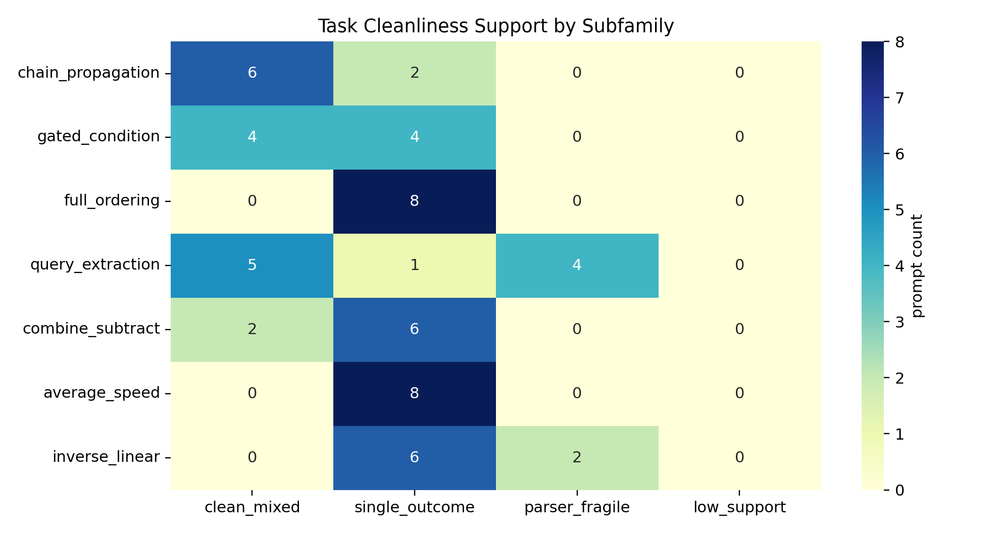

# From Reasoning Families to Regime Mechanisms

*A working research note from a personal learning project on LLM reasoning geometry.*

This note is not a final claim. It is a checkpoint after the project moved from a broad question about static semantic axes into a more specific question:

> Can task form predict the kind of local geometry that appears during reasoning?

The original goal stays the same:

> Does LLM reasoning mostly follow a static semantic manifold, or does the trajectory itself induce local structure?

The current answer is leaning toward the second option, but with an important refinement: the local structure is not one universal thing. Different task forms seem to create different local regimes.

## TL;DR

- Static semantic axes still under-explain the actual reasoning motion.
- The best current unit is no longer just `task family`; it is `subfamily`.
- Some subfamilies look `state_dominant`, some look `two_stage`, and some are better described as `history_sensitive`.
- A recent audit showed that task/oracle cleanliness matters a lot. Some apparent model failures were actually parser or prompt-design issues.
- The next research step should be mechanism-specific validation, not just more traces.

## The working picture

Earlier in the project, I was asking whether reasoning traces cluster into recurring residual directions after static semantic axes are removed. That was useful, but too coarse. The better question now is:

> What kind of local regime does each task form create?

The current mechanism map looks like this:

The current labels are intentionally modest:

- `state_dominant`: the local branch state already carries most of the decision signal
- `two_stage`: interaction appears before the branch, then state carries the local commitment
- `history_sensitive`: similar local neighborhoods preserve different continuation geometry depending on history
- `distributed_shaping_candidate`: phase contributions appear spread rather than concentrated at one branch
- `mixed_or_weak`: structured, but not sharp enough yet

This is a shift from:

> family -> geometry

to:

> task form -> regime mechanism

## What looks supported right now

The strongest cases are still causal and temporal.

`causal/gated_condition` looks `state_dominant`. It is a binary gate: either the condition opens or it does not. That task form compresses the answer space, so it makes sense that a local branch state can carry the decision.

`causal/chain_propagation` looks more `two_stage`. The task has a propagated chain of consequences. In this case, the prebranch region seems to organize the landscape, and the branch-local state then carries the outcome.

`temporal/full_ordering` also looks `state_dominant` in the current read. A full ordering task seems to collapse into a local ordering state near the branch window.

This is the current strength view:

The scores are heuristic. They combine path divergence, branch sharpness, local atlas gain, collapse behavior, and same-location/history angle. They are not p-values.

## The query extraction lesson

`temporal/query_extraction` was originally confusing. It looked like a late-split candidate, but the evidence was unstable.

The problem was not only the model. The temporal oracle was also fragile. It was accidentally treating question words and generic labels as entities:

- `Who`
- `Which`
- `What`
- `Event`
- `Stage`

After fixing that, the usable correct support improved. The combined fixed set now has:

- `60` traces
- `16` correct
- `44` incorrect

This changed the interpretation. `query_extraction` now shows a real same-location/different-history signal:

- valid neighborhoods: `13`
- median principal angle: `78.4 deg`

But it still does not show a strong commitment-collapse signal:

- entropy gain over matched control: `0.107`
- variance gain over matched control: `-0.041`

So the better label is not `state_dominant` or `two_stage`. It is:

> `history_sensitive`

That is useful. It means not every interesting local regime has to look like a clean commitment point.

## Why task cleanliness now matters

The task audit was the most practical improvement in this round.

The audit separates prompts into:

- `clean_mixed`: parser works and both outcomes appear
- `single_outcome`: parser works, but only one outcome appears
- `parser_fragile`: oracle or parser is not trustworthy enough yet

Current support:

- `causal/chain_propagation`: strong clean mixed support
- `causal/gated_condition`: usable clean mixed support
- `temporal/query_extraction`: usable clean mixed support after fixing the oracle
- `arithmetic/combine_subtract`: limited clean mixed support
- `temporal/full_ordering`: currently mostly single-outcome
- `average_speed`: currently mostly single-outcome
- `inverse_linear`: partly parser-fragile

This matters because some analyses require both correct and incorrect traces inside similar local neighborhoods. If a prompt is single-outcome, it may still be useful for generation diagnostics, but it is weak for same-location/history tests.

## The current mechanism table

The machine-readable table is here:

[regime_mechanism_table.csv](../outputs/regime_mechanism_synthesis/regime_mechanism_table.csv)

The current short version:

| Subfamily | Current label | Status | Best interpretation |
|---|---|---|---|
| `gated_condition` | `state_dominant` | supported | binary gate compresses the answer space |
| `chain_propagation` | `two_stage` | supported | prebranch interaction, then branch-local state |
| `full_ordering` | `state_dominant` | supported, but needs cleaner prompt support | local ordering state carries discrimination |
| `query_extraction` | `history_sensitive` | candidate | history matters inside similar local neighborhoods |
| `combine_subtract` | `late_split_candidate` | candidate | visible middle-to-late split, thinner commitment evidence |
| `average_speed` | `distributed_shaping_candidate` | candidate | phase effects look spread out |
| `inverse_linear` | `mixed_or_weak` | weak | not enough clean evidence yet |

## What this says about the original hypothesis

The original hypothesis was:

> reasoning trajectories induce local low-dimensional structure rather than simply selecting static semantic axes.

The current version is sharper:

> reasoning trajectories appear to enter task-form-specific local regimes, and those regimes differ in how they carry outcome information.

This is stronger than just saying "there is residual geometry." It says the residual geometry has roles:

- some regimes carry a state-like local decision
- some build a landscape before commitment
- some preserve history without clean collapse
- some shape the path across multiple phases

This is also why the biological metaphor remains useful as a metaphor only. The static manifold is like a substrate. The trajectory-conditioned regime is more like a regulatory state. The phase profile is more like timing. The actual behavior comes from how state and timing interact.

## What I would do next

The next experiments should be smaller and cleaner.

1. Build a clean deterministic prompt bank.
   Focus on prompts where the oracle is reliable and both outcomes can appear.

2. Apply mechanism-specific validators.
   Do not use the same validator for every regime. `history_sensitive` should not be judged by the same collapse metric as `state_dominant`.

3. Revalidate the candidates.
   Priority order: `query_extraction`, `combine_subtract`, `average_speed`, `inverse_linear`.

4. Turn task form into a predictor.
   Use simple variables first: answer-space size, binary gate, propagation depth, query extraction, full ordering, ratio aggregation, inverse solve.

## Bottom line

The project is no longer just asking whether LLM reasoning has dynamic geometry. It is starting to ask what kind of dynamic geometry different task forms produce.

The most useful current sentence is:

> static semantic structure is not enough; reasoning appears to use task-form-specific local regimes, and those regimes carry outcome information in different ways.
