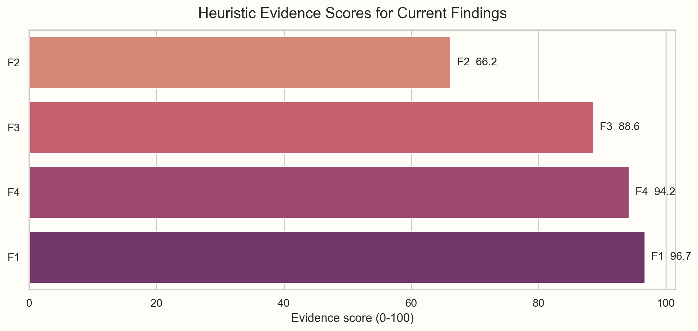
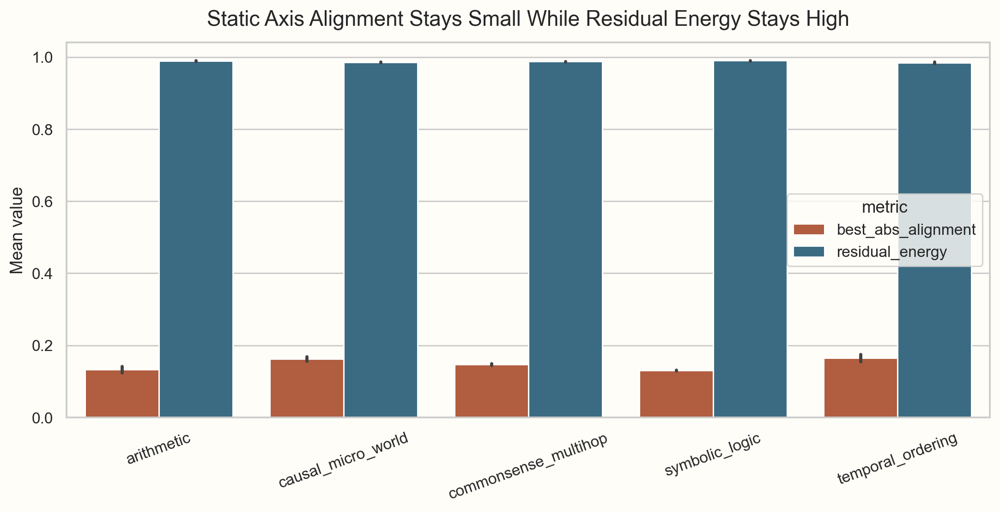
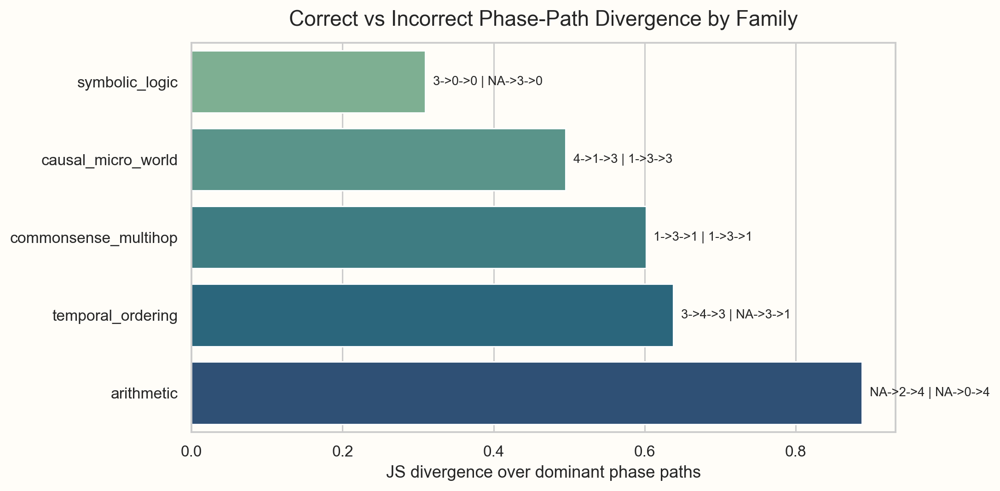
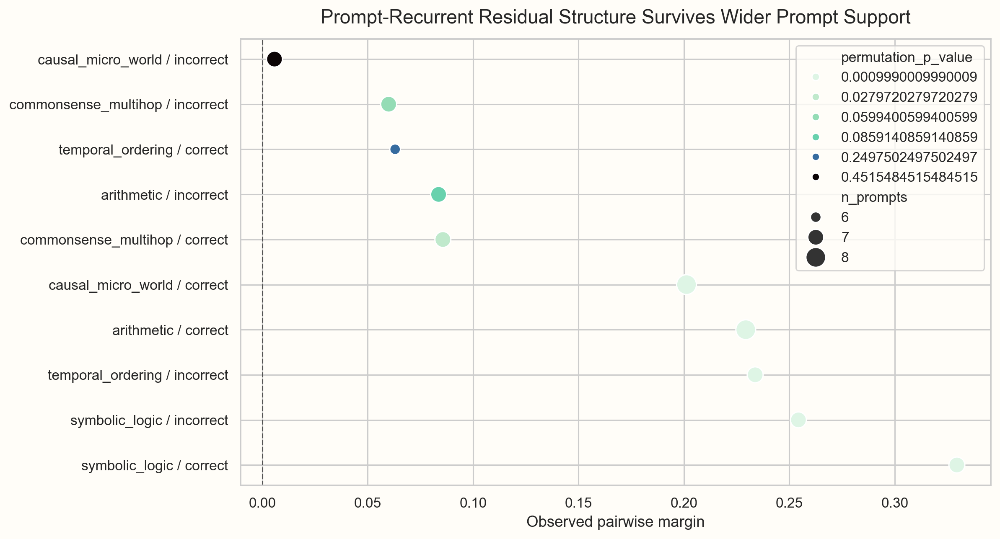
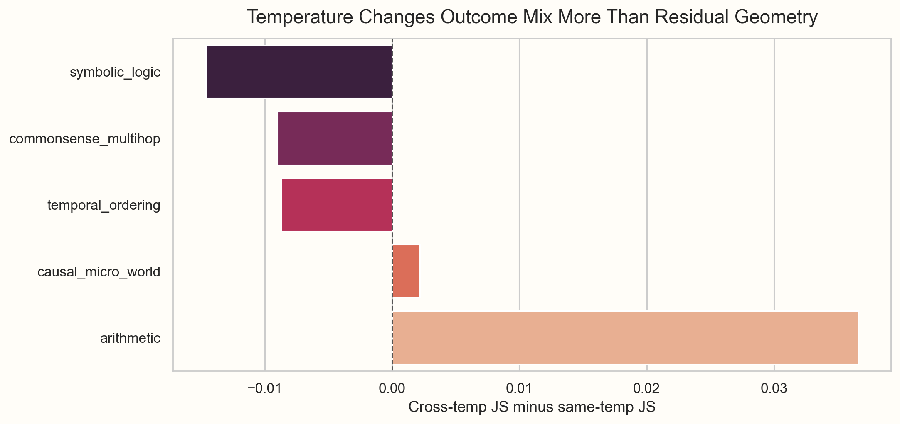
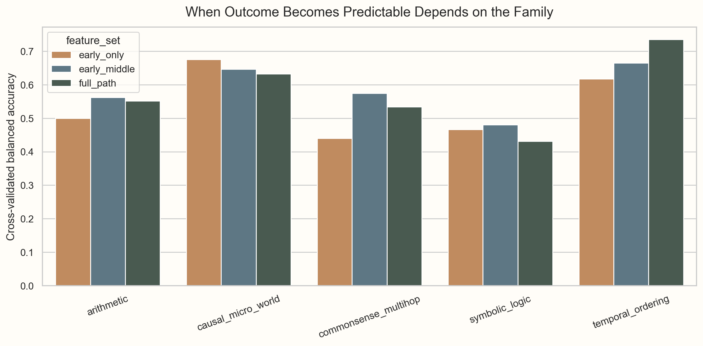

# Trajectory-Induced Subspaces: An Exploratory Research Report

*This repository is a personal learning project and an open exploratory workbench. The goal of this report is not to present a polished final theory, but to make the current experiments, figures, and partial conclusions legible.*

## TL;DR

- Static semantic axes do not explain most of the actual reasoning motion.
- The leftover residual geometry is not random junk. Some of it recurs under repeated prompting.
- That recurrence is uneven: it depends much more on task family, outcome, and phase than on temperature.
- Different families seem to "go wrong" at different times in the trace.

## What this project is trying to understand

The central question is:

> Does LLM reasoning mostly follow static semantic structure, or does the trajectory itself induce local residual geometry?

The project started from a simple intuition: a reasoning trace may not just *select* an axis that is already sitting inside embedding space. It may instead *create* a local subspace as the trace unfolds.

At this point, the project has accumulated two main experimental views:

- a **static manifold view** through Spatial Semantomics
- a **dynamic trajectory view** through trajectory deltas and residual-regime analysis

The current datasets used in this report are:

- temperature-conditioned run: **300 traces / 1302 steps / 1002 deltas**
- repeated 8x5 run: **200 traces / 861 steps / 661 deltas**

## 1. A quick scoreboard

The first question was not “what is true?” but “which of the current findings have started to look durable?”

The strongest findings so far are:

- static semantic axes do **not** explain most dynamic reasoning movement
- residual regimes look **phase-specific** and often **path-specific**
- family and outcome structure seem to matter more than temperature

Prompt recurrence is real too, but it is more uneven across families, so it still feels more exploratory than the other findings.

## 2. Static structure is real, but it is not enough

One of the cleanest plots in the project is the gap between static-axis alignment and residual energy.

If reasoning were mostly “axis following,” I would expect much higher best-axis alignment and much lower residual energy. Instead, the residual stays very large across families and outcomes.

That does **not** mean static structure is irrelevant. It means static structure looks more like a background organization of semantic space than a sufficient explanation of the actual reasoning motion.

## 3. The interesting part is not just that failures differ, but *how* they differ

Once the trace is cut into phases, the geometry becomes more legible. Instead of asking “is incorrect reasoning noisier?”, a better question becomes:

> Do correct and incorrect traces move through different residual-regime paths?

This is where the project started to feel less like a generic embedding experiment and more like a geometry-of-reasoning experiment:

- **Arithmetic** often diverges early or in the middle.
- **Temporal ordering** looks more late-path-sensitive.
- **Causal micro world** often seems to pick a regime quite early.
- **Commonsense** is trickier: the dominant path can match while the full path distribution still diverges.

That last point matters. Sometimes the mode path is the same, but the distribution over paths is still different enough to show a meaningful divergence.

## 4. Some of the residual geometry really does recur at the prompt level

One obvious alternative explanation is that the residual structure is just sampling noise. Repeated prompt runs were the first serious attempt to pressure-test that.

The broad pattern is:

- several family/outcome groups keep positive same-prompt margins even as prompt support grows
- `symbolic_logic`, `temporal_ordering (incorrect)`, `arithmetic (correct)`, and `causal_micro_world (correct)` remain relatively strong
- `commonsense` and some incorrect groups are noisier and less stable

So the honest reading is not “all residual structure is prompt-recurrent.”  
It is:

> some residual regimes are reproducible enough that shuffled baselines stop looking plausible, but the strength of this recurrence is family-dependent.

## 5. Temperature matters, but it is not the main organizing variable

I expected temperature to maybe wash out the recurrence story. It did not.

Temperature does change the **correct/incorrect mix**, but the residual-regime structure is usually not dramatically more similar at the same temperature than across temperatures. In other words:

- temperature affects behavior
- but the geometry still seems more constrained by **family**, **outcome**, and **phase**

That is one reason the project now leans more strongly toward the phrase *trajectory-induced local structure* rather than a simpler “sampling artifact” explanation.

## 6. Different families seem to decide at different times

The next question was timing:

> When does the reasoning path become informative about the eventual outcome?

The answer is not uniform:

- **Causal micro world** is often informative already from early-phase information.
- **Arithmetic** seems to need the early-to-middle transition to become more legible.
- **Temporal ordering** becomes more predictable when the path is seen more fully.
- **Symbolic logic** remains relatively subtle in this framing.

This is important because it suggests that “failure” is not a single kind of event. For some families it looks like **early regime selection**. For others it looks closer to **late commitment**.

## 7. Current working mental model

Right now the project feels best summarized by this sequence:

1. The prompt family places the model in a broad semantic neighborhood.
2. The reasoning trace enters a local residual regime.
3. Phase-to-phase movement creates a path through that regime.
4. Correct and incorrect outcomes often correspond to different regime paths.
5. Static semantic axes still matter, but they do not explain the motion by themselves.

This is still exploratory. But it is already more specific than “reasoning is geometric.”

## What surprised me most

- **Temperature mattered less than I expected.** It clearly changes the correct/incorrect mix, but it does not seem to be the dominant organizing variable for residual structure.
- **Phase mattered more than I expected.** Once the traces were cut into early, middle, and late segments, the geometry became much easier to read.
- **Arithmetic did not just look noisy.** It often looked like a family that branches into a different regime relatively early.

## What feels strongest right now

- **Static semantic manifold alone is not enough.**
- **Residual geometry is real and often family-specific.**
- **Some residual regimes recur under repeated prompting.**
- **Phase structure matters a lot.**
- **Temperature is secondary to family/outcome/phase structure.**

## What still feels unsettled

- some families, especially parts of commonsense, still look unstable
- current residual clusters are useful but still exploratory
- the project has more evidence for “not static-axis-only” than for a final universal alternative model
- prompt-level recurrence is real in several buckets, but not yet clean enough to claim a single universal pattern

## Where I would push next

- build a robustness map over family × outcome × phase × temperature
- compare the full repeated datasets across multiple embedding backbones
- turn phase paths into a more explicit transition-graph or Sankey-style view
- test whether early-phase features predict held-out prompts, not just held-out traces

## Where to browse next

- exploratory note: [outputs/exploratory_research_note.md](../outputs/exploratory_research_note.md)
- dashboard: [outputs/dashboard/index.html](../outputs/dashboard/index.html)
- evidence scores: [outputs/finding_evidence_scores.csv](../outputs/finding_evidence_scores.csv)

The project is still evolving, but at this point the main exploratory conclusion is fairly stable:

> reasoning does not look well described as simple static-axis following; it looks more like family-specific, phase-sensitive local geometry.
